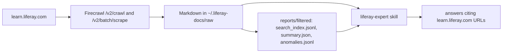

# liferay-context-builder

Builds a local, cited copy of the Liferay DXP documentation from
`learn.liferay.com` so a coding agent can read the real docs before answering
Liferay questions.

- Official docs (`learn.liferay.com/w/dxp/*`, ~2,000 pages) and, optionally,
  community How-To and Troubleshooting articles (`/kb-article/*`, ~4,800).
- Plain Markdown files with source URL and fetch time in the frontmatter, plus a
  JSONL search index. No vector database, no embeddings, no bundled Liferay
  content.
- Fetching goes through a self-hosted [Firecrawl](https://github.com/firecrawl/firecrawl)
  v2 instance, using only its markdown and rawHtml formats (no LLM needed).
- Refreshing is manual: run the builder when you want fresh docs.
- Ships the `liferay-expert` agent skill that searches the library and cites it.

Python 3.10-3.13 · [MIT license](LICENSE) · fork of
[mordonez/liferay-context-builder](https://github.com/mordonez/liferay-context-builder)

## Quickstart

```bash
# 1. Start Firecrawl (in your Firecrawl checkout) and wait until it is live
docker compose up -d
curl -s -o /dev/null -w "%{http_code}\n" http://localhost:3002/v0/health/liveness   # -> 200

# 2. Build the official docs library (~20-25 min) into ~/.liferay-docs
cd /path/to/liferay-context-builder
uv run liferay-context-builder

# 3. Optional: community articles (~1 h)
uv run liferay-context-builder-community

# 4. Check the result
uv run liferay-context-builder-doctor

# 5. Stop Firecrawl
cd /path/to/firecrawl && docker compose stop
```

The PyPI package of the same name is the upstream project and does not use
Firecrawl; run these commands from a checkout of this repository with `uv run`.

## Requirements

- Python 3.10-3.13 and [`uv`](https://docs.astral.sh/uv/)
- A running self-hosted Firecrawl v2 API:

| Variable | Default | Purpose |
|---|---|---|
| `FIRECRAWL_API_URL` | `http://localhost:3002` | Firecrawl base URL |
| `FIRECRAWL_API_KEY` | unset | Sent as `Authorization: Bearer <key>` when set |
| `LIFERAY_DOCS_DIR` | `~/.liferay-docs` | Where the library is written and read |

```bash
# Example: Firecrawl on another host, library inside the current repo
export FIRECRAWL_API_URL=http://build-box:3002
export LIFERAY_DOCS_DIR="$PWD/.liferay-docs"
uv run liferay-context-builder
```

## How It Works



**Official docs** (`liferay-context-builder`):

1. One Firecrawl crawl job starts at `https://learn.liferay.com/w/dxp/index` and
   follows links:
   `includePaths: ["^/w/dxp(/|$)"]`, `crawlEntireDomain: true`,
   `sitemap: "skip"`, `maxDiscoveryDepth: 12`, `limit: 3000`, `delay: 1`.
   The site's child sitemaps return empty bodies, so discovery relies on links.
2. Each page is scraped with `includeTags: [".learn-article-content"]`, which
   returns the article body without navigation, banners or cookie dialogs.
3. The URL prefix decides the capability folder; pure table-of-contents pages go
   to `raw/_navigation/`.
4. Pages that failed or came back empty are re-scraped once in a batch job.
5. Files from the previous run that were not rediscovered are checked directly:
   still live → refreshed; HTTP 404/410 → moved to `raw/_removed/`.
6. Reports and the search index are regenerated.

**Community articles** (`liferay-context-builder-community`): pages through the
server-rendered search listing (`/learn-search?resource-type=...`, 60 links per
page), batch-scrapes each article as raw HTML, extracts title, tags and
`.knowledge-article-content`, converts it with `markdownify`, and retries
missed articles once.

**Failure behaviour**

- Firecrawl unreachable → one-line error naming `FIRECRAWL_API_URL`, exit 1.
- A Firecrawl job with no status for 3 polls, or no progress for 10 minutes →
  crawl error, no pages are quarantined, exit 1.
- Any page still failing after the retry is listed and the run exits 1; pages
  already written stay valid.

## Command Reference

```bash
uv run liferay-context-builder                      # full official-docs build
uv run liferay-context-builder --max-pages 30       # quick smoke run
uv run liferay-context-builder --max-depth 12 --max-pages 3000

uv run liferay-context-builder-community                              # How-To + Troubleshooting
uv run liferay-context-builder-community --resource-type howto        # one type
uv run liferay-context-builder-community --resource-type troubleshooting --limit 100

uv run liferay-context-builder-doctor                                 # status of docs + skill
uv run liferay-context-builder-doctor --project-dir /path/to/project
```

Example output of a smoke run:

```text
$ uv run liferay-context-builder --max-pages 30
Starting crawl (~20-25 min usually) -- progress every 50 pages...

Total discovered under /w/dxp: 30

By capability (new / updated / unchanged / navigation):
  cloud       :    4 total  (4 new, 0 updated, 0 unchanged, 1 navigation)
  self-hosted :    5 total  (5 new, 0 updated, 0 unchanged, 0 navigation)
  sites       :    4 total  (4 new, 0 updated, 0 unchanged, 0 navigation)
  ...
Total in scope: 29 (4 in raw/_navigation/, 25 in raw/{capability}/)
Quarantined (URL verified as gone, HTTP 404/410): 0
```

```text
$ uv run liferay-context-builder-community --resource-type howto --limit 10
Discovered: 10
Written: 10
Fetch failures: 0
By capability:
  _uncategorized: 5
  content-management-system: 3
  digital-asset-management: 1
  sites: 1
```

Timings: official docs ~20-25 minutes on a warm Firecrawl stack (the first crawl
after a cold `docker compose up` is noticeably slower); community ~1 hour.
The skill flags docs older than about 7 days, so a weekly refresh is plenty.

## The Library

```text
~/.liferay-docs/
  raw/{capability}/*.md                      official docs (read first)
  raw/_navigation/{capability}/*.md          table-of-contents pages
  raw/_removed/{capability}/*.md             pages confirmed gone (404/410)
  raw/community-howto/{capability}/*.md
  raw/community-troubleshooting/{capability}/*.md
  reports/filtered/
    search_index.jsonl                       one JSON line per page
    summary.json                             counts of the last run
    anomalies.jsonl                          short/odd pages worth a check
    {capability}_urls.txt                    in-scope URLs per capability
    removed_log.jsonl                        quarantine log
```

Capabilities: `search`, `commerce`, `development`, `sites`, `low-code`,
`security`, `self-hosted`, `content-management-system`, `integration`, `cloud`,
`digital-asset-management`, `personalization`, `ai`, `getting-started`.
Community articles without a usable capability tag go to `_uncategorized/`.

Official page, e.g. `raw/self-hosted/cloud-native-experience-cne-kubernetes-ready.md`:

```markdown
---
url: "https://learn.liferay.com/w/dxp/self-hosted-installation-and-upgrades/cloud-native-experience/cne-kubernetes-ready"
capability: self-hosted
fetched_at: "2026-09-23T15:58:04Z"
content_hash: "sha256:201204a2871c69a8e5fdc2ca71d3abc6f1734087bba4b9d60d681091110e7b4c"
---
[Cloud Native Experience Kubernetes Ready](https://learn.liferay.com/w/dxp/...)
=====

The Kubernetes Ready path of the Cloud Native Experience (CNE) deploys Liferay DXP
on any CNCF-conformant Kubernetes cluster using the official `liferay-default` Helm chart. ...
```

Community article, e.g. `raw/community-howto/_uncategorized/auditing-the-remote-client-ip-address-changed-after-upgrade.md`:

```markdown
---
url: "https://learn.liferay.com/kb-article/auditing-the-remote-client-ip-address-changed-after-upgrade"
source_type: community-howto
capability: uncategorized
deployment_approach: "Liferay Self-Hosted"
applicable_versions: "DXP 7.4, DXP 7.0"
resource_type: "How To"
fetched_at: "2026-09-23T16:00:48Z"
content_hash: "sha256:30a53478..."
---
# Auditing the remote client IP address changed after upgrade

## Issue

* After upgrading from Liferay 7.0 to a more recent Quarterly Release ...
```

Search index line (`reports/filtered/search_index.jsonl`):

```json
{"title": "Cloud Native Experience Cne Kubernetes Ready", "url": "https://learn.liferay.com/w/dxp/self-hosted-installation-and-upgrades/cloud-native-experience/cne-kubernetes-ready", "source_type": "official", "capability": "self-hosted", "path": "raw/self-hosted/cloud-native-experience-cne-kubernetes-ready.md", "headings": [], "fetched_at": "2026-09-23T15:58:04Z"}
```

Searching it by hand:

```bash
cd ~/.liferay-docs
grep -i "synonym" reports/filtered/search_index.jsonl | head        # shortlist by title/headings
grep -ril "client extension" raw/development/ | head                # full-text in one capability
grep -ril "ClassNotFoundException" raw/community-troubleshooting/   # error text -> troubleshooting
jq '{discovered_total, fetch_failed_count}' reports/filtered/summary.json
```

## The Skill

`skills/liferay-expert/SKILL.md` teaches an agent to find the library
(`$LIFERAY_DOCS_DIR`, else `~/.liferay-docs`), shortlist via the search index,
read the matching Markdown, and cite the frontmatter `url`. Community articles
are labelled as community content and official docs win when both cover a
topic. The skill never starts a build itself; when docs are missing or older
than ~7 days it tells you which command to run.

Install it into a Claude Code project:

```bash
npx skills add wsyski/liferay-context-builder --skill liferay-expert -a claude-code
# or copy it manually
mkdir -p .claude/skills/liferay-expert && cp /path/to/liferay-context-builder/skills/liferay-expert/SKILL.md .claude/skills/liferay-expert/
```

Example questions it answers from the library:

> How do I configure synonym sets in Liferay Search?
>
> Which Helm chart does the Cloud Native Experience Kubernetes path use?
>
> After upgrading to a quarterly release the audit table stores a different client IP — why?

## Doctor

```text
$ uv run liferay-context-builder-doctor
Docs dir: ~/.liferay-docs
Official docs: OK (25 markdown files, 30 discovered in last report)
Community docs: 10 markdown files
Official freshness: 2026-09-23 .. 2026-09-23
Search index: 35 entries
Anomalies report: 23 entries
Claude Code skill: MISSING (/path/to/project/.claude/skills/liferay-expert/SKILL.md)

Next steps:
  npx skills add wsyski/liferay-context-builder --skill liferay-expert -a claude-code
```

It reports the active docs directory, official and community file counts, the
freshness window, index and anomaly counts, and whether the skill is installed
in the project. It never builds or installs anything.

## Troubleshooting

**`ERROR: Firecrawl not reachable at http://localhost:3002`** — start Firecrawl
(`docker compose up -d` in its checkout) or point `FIRECRAWL_API_URL` at the
running instance.

**`crawl job ... stalled` or `status unavailable`** — the Firecrawl job stopped
progressing (worker crash, stack restart). Check `docker compose logs api` in
the Firecrawl checkout, then rerun.

**Run ends with fetch failures** — the listed pages failed twice. Rerun later;
everything already written stays valid and nothing is quarantined on a failed
crawl.

**Agent says docs are missing** — check `echo "$LIFERAY_DOCS_DIR"`; the builder
and the skill must use the same directory. Run the doctor.

**Docs are stale** — rerun `uv run liferay-context-builder`.

## Development

```bash
uv sync --group dev
uv run --group dev pytest -q
uv run --group dev ruff check src tests
uv build
```

Tests mock the Firecrawl API; no network access is needed. CI runs lint, tests
and a package build on Python 3.10-3.13. Design decisions are in
[`docs/adr/`](docs/adr/).

## License

[MIT](LICENSE) applies to this tool and skill only. Liferay documentation
content remains Liferay's and is fetched locally by each user.
