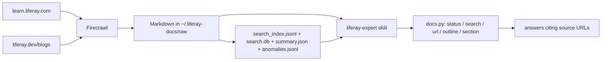

# liferay-context-builder

Builds a local, cited, searchable copy of Liferay documentation so a coding agent
can read the real docs before answering Liferay questions. It is built for agents,
not humans: every design choice favours an agent finding the right page quickly
with bounded output.

- **Three sources**, in decreasing authority: the official docs
  (`learn.liferay.com/w/dxp/*`, ~1,700 pages), community How-To and Troubleshooting
  articles (`/kb-article/*`, ~4,900) and recent community blog posts
  (`liferay.dev/blogs`, 2022 onward, ~350 technical posts).
- **Plain Markdown files** with source URL, fetch time and metadata in the
  frontmatter, plus two indexes: a JSONL catalogue and an SQLite FTS5 full-text
  index over every page body. No vector database, no embeddings, no bundled Liferay
  content.
- **Fetching goes through a self-hosted [Firecrawl](https://github.com/firecrawl/firecrawl)**
  v2 instance, using only its markdown and rawHtml formats (no LLM involved).
- **One command builds everything** (`uv run liferay-context-builder`); refreshing
  is manual.
- **Ships the `liferay-expert` agent skill** with a small script (`scripts/docs.py`)
  for status, ranked full-text search, and section-level reads of large pages.

Python 3.10-3.13 · [MIT license](LICENSE) · fork of
[mordonez/liferay-context-builder](https://github.com/mordonez/liferay-context-builder)

## Quickstart

```bash
# 1. Start Firecrawl (in your Firecrawl checkout) and wait until it is live
docker compose up -d
curl -s -o /dev/null -w "%{http_code}\n" http://localhost:3002/v0/health/liveness   # -> 200

# 2. Build the whole library into ~/.liferay-docs (~1.5 h): official docs, then
#    community KB articles, then liferay.dev blog posts
cd /path/to/liferay-context-builder
uv run liferay-context-builder
#    official docs only (~20-25 min):
#    uv run liferay-context-builder --official-only

# 3. Check the result
uv run liferay-context-builder-doctor

# 4. Stop Firecrawl
cd /path/to/firecrawl && docker compose stop
```

The PyPI package of the same name is the upstream project and does not use
Firecrawl; run these commands from a checkout of this repository with `uv run`.

## Requirements

- Python 3.10-3.13 and [`uv`](https://docs.astral.sh/uv/)
- A running self-hosted Firecrawl v2 API:

| Variable | Default | Purpose |
|---|---|---|
| `FIRECRAWL_API_URL` | `http://localhost:3002` | Firecrawl base URL |
| `FIRECRAWL_API_KEY` | unset | Sent as `Authorization: Bearer <key>` when set |
| `LIFERAY_DOCS_DIR` | `~/.liferay-docs` | Where the library is written and read |

```bash
# Example: Firecrawl on another host, library inside the current repo
export FIRECRAWL_API_URL=http://build-box:3002
export LIFERAY_DOCS_DIR="$PWD/.liferay-docs"
uv run liferay-context-builder
```

## How It Works


```mermaid
flowchart LR
  A[learn.liferay.com] --> B[Firecrawl]
  A2[liferay.dev/blogs] --> B
  B --> C[Markdown in ~/.liferay-docs/raw]
  C --> D[search_index.jsonl + search.db + summary.json + anomalies.jsonl]
  C --> E[liferay-expert skill]
  D --> E
  E --> F[docs.py: status / search / url / outline / section]
  F --> G[answers citing source URLs]
```

`liferay-context-builder` runs three stages in order and then rebuilds the search
indexes. Each stage also has its own command (see the Command Reference).

### Stage 1: official docs (`liferay-context-builder --official-only`)

1. One Firecrawl crawl job starts at `https://learn.liferay.com/w/dxp/index` and
   follows links:
   `includePaths: ["^/w/dxp(/|$)"]`, `crawlEntireDomain: true`,
   `sitemap: "skip"`, `maxDiscoveryDepth: 12`, `limit: 3000`, `delay: 1`.
   The site's child sitemaps return empty bodies, so discovery relies on links.
2. Each page is scraped with `includeTags: [".learn-article-content"]`, which
   returns the article body without navigation, banners or cookie dialogs.
3. The URL prefix decides the capability folder; pure table-of-contents pages go
   to `raw/_navigation/`.
4. Pages Firecrawl could not scrape are read from the crawl's `/errors` endpoint
   (see Failure behaviour) and, with any page that came back empty, re-scraped
   once in 100-URL batch jobs.
5. Files from the previous run that were not rediscovered are checked directly:
   still live → refreshed; HTTP 404/410 → moved to `raw/_removed/`. If a
   capability's page count drops below half of what is on disk (a likely
   incomplete crawl), nothing is quarantined for it and its unseen pages are
   refreshed directly instead.
6. Reports and the search indexes are regenerated.

### Stage 2: community articles (`liferay-context-builder-community`)

Pages through the server-rendered search listing
(`/learn-search?resource-type=...`, 60 links per page; a failed listing page is
retried once), batch-scrapes each article as raw HTML, extracts title, tags and
`.knowledge-article-content`, and converts it with `markdownify`.

- **Resumable.** Articles already on disk are skipped unless `--refresh` is given,
  so a run that lost articles only refetches the missing ones.
- **Retry rounds.** Failed articles are retried in up to three more rounds,
  stopping early if a round recovers none.
- **Capability mapping.** The article's `Capability` tag is matched against known
  names (`CAPABILITY_TAG_MAP`); unmatched articles go to `_uncategorized/`. Known
  names that contain commas ("DXP Self-Hosted Installation, Maintenance, and
  Administration") are matched as whole values. Skipped articles are moved to the
  folder their stored tag maps to today, without refetching.

### Stage 3: blog posts (`liferay-context-builder-blogs`)

Pages through `liferay.dev/blogs?delta=20&start=<page>` (newest first) until a
page has nothing at or after `--since` (default 2022-01-01), then batch-scrapes the
posts as raw HTML and keeps the article body.

- **Filtering.** Posts categorised `News` (release announcements, webinars, events)
  are skipped unless `--include-news` is given (about 139 of 489 since 2022).
- **Pacing and blocks.** Listing pages are scraped one at a time, 2 s apart. The site
  returns 403 for deep listing pages; that ends discovery early, keeps what was
  found, and exits 1.
- **Capability folders.** A post is filed under the capability its first mappable
  site category names (`AI`, `Cloud`, `CMS`, `Commerce`, `Customer Data`,
  `Frameworks`, `Integration`, `Low-Code`, `Security`, `Sites`); the rest, about
  80%, go to `_uncategorized/`. A re-run moves posts whose categories changed
  without refetching them.
- **Refresh.** Posts already on disk are skipped unless `--refresh` is given or the
  site's Atom feed (latest 20 posts, matched by title and date) shows they were
  edited after they were fetched. An unreadable feed only warns.

### One command builds everything

`liferay-context-builder` runs the official crawl, then the community articles,
then the blog posts, and exits 1 if any stage reported a failure. A stage that
fails does not skip the next one (except that a Firecrawl outage stops the rest).
`--official-only` stops after the official docs. `--max-depth` and `--max-pages`
apply to the official stage only. `--reindex-only` rebuilds the search indexes from
the files on disk without crawling.

### Failure behaviour

- Firecrawl unreachable → one-line error naming `FIRECRAWL_API_URL`, exit 1.
- **Silent crawl drops are recovered.** Firecrawl leaves pages it could not scrape
  out of a crawl's data and lists them only at `GET /v2/crawl/{id}/errors`. The
  client reads that endpoint and yields those pages as failed, so the retry pass
  sees them instead of mistaking them for pages the crawl never found
  (external-link and off-host entries are ignored).
- **Partial results survive.** A crawl or batch job that fails, is cancelled or
  stalls yields whatever it scraped before raising.
- **Transient poll problems are tolerated.** A non-JSON error body (a proxy 502) or a
  read timeout counts as a failed call, and a job status missing for 6 polls, or no
  progress for 10 minutes, becomes a crawl error (no pages are quarantined, exit 1).
- **Batches are chunked.** Batch scrapes are split into jobs of 100 URLs run one after
  another (`BATCH_CHUNK_SIZE` in `fetcher.py`). A self-hosted Firecrawl fails the
  jobs of a very large batch in bulk (see Design notes): one batch of 3,603 kept 42%
  of its pages, one of 1,327 kept 99%. A batch job that dies is reported on stderr
  and its URLs are retried instead of stopping the run.
- Any page still failing after the retries is listed and the run exits 1; pages
  already written stay valid.

## Command Reference

```bash
uv run liferay-context-builder                      # everything: official docs, community KB articles, blogs
uv run liferay-context-builder --official-only      # official docs only (~20-25 min)
uv run liferay-context-builder --reindex-only       # rebuild search.db and search_index.jsonl, no crawling (seconds)
uv run liferay-context-builder --official-only --max-pages 30   # quick smoke run
uv run liferay-context-builder --official-only --max-depth 12 --max-pages 3000

# the two extra stages also run on their own:
uv run liferay-context-builder-community                              # How-To + Troubleshooting (resumes)
uv run liferay-context-builder-community --resource-type howto        # one type
uv run liferay-context-builder-community --refresh                    # refetch articles already on disk
uv run liferay-context-builder-community --resource-type troubleshooting --limit 100

uv run liferay-context-builder-blogs                                  # posts since 2022-01-01, no News
uv run liferay-context-builder-blogs --since 2024-01-01 --limit 20    # smaller test run
uv run liferay-context-builder-blogs --include-news --refresh         # everything, re-fetch existing

uv run liferay-context-builder-doctor                                 # read-only check: docs, per-source counts, index drift, skill
uv run liferay-context-builder-doctor --project-dir /path/to/project   # look for the skill in this project first

uv run python evals/search_eval.py                                    # score search quality on the real library
```

Example output of a smoke run:

```text
$ uv run liferay-context-builder --official-only --max-pages 30
Starting crawl (~20-25 min usually) -- progress every 50 pages...

Total discovered under /w/dxp: 30

By capability (new / updated / unchanged / navigation):
  cloud       :    4 total  (4 new, 0 updated, 0 unchanged, 1 navigation)
  self-hosted :    5 total  (5 new, 0 updated, 0 unchanged, 0 navigation)
  sites       :    4 total  (4 new, 0 updated, 0 unchanged, 0 navigation)
  ...
Total in scope: 29 (4 in raw/_navigation/, 25 in raw/{capability}/)
Quarantined (URL verified as gone, HTTP 404/410): 0
```

```text
$ uv run liferay-context-builder-community --resource-type howto --limit 10
Discovered: 10
Written: 10
Fetch failures: 0
By capability:
  _uncategorized: 5
  content-management-system: 3
  digital-asset-management: 1
  sites: 1
```

Timings on a warm Firecrawl stack: official docs ~20-25 minutes (the first crawl
after a cold `docker compose up` is slower); community ~1 hour for a full first run,
much less when resuming; blogs a few minutes for a first run and seconds when every
post is already on disk. The skill flags official docs older than about 7 days, so a
weekly refresh is plenty.

## The Library

```text
~/.liferay-docs/
  raw/{capability}/*.md                      official docs (read first)
  raw/_navigation/{capability}/*.md          table-of-contents pages
  raw/_removed/{capability}/*.md             pages confirmed gone (404/410)
  raw/community-howto/{capability}/*.md
  raw/community-troubleshooting/{capability}/*.md
  raw/community-blog/{capability}/*.md       blog posts, with published_at
  reports/filtered/
    search.db                                full-text (SQLite FTS5) index of every page body
    search_index.jsonl                       one JSON line per page
    summary.json                             counts of the last official run
    {source}_summary.json                    counts of the last community / blog run
    anomalies.jsonl                          short/odd pages worth a check
    {capability}_urls.txt                    in-scope URLs per capability
    removed_log.jsonl                        quarantine log
```

Capabilities: `search`, `commerce`, `development`, `sites`, `low-code`,
`security`, `self-hosted`, `content-management-system`, `integration`, `cloud`,
`digital-asset-management`, `personalization`, `ai`, `getting-started`.
Community articles and blog posts without a usable capability go to `_uncategorized/`.

Official page, e.g. `raw/self-hosted/cloud-native-experience-cne-kubernetes-ready.md`:

```markdown
---
url: "https://learn.liferay.com/w/dxp/self-hosted-installation-and-upgrades/cloud-native-experience/cne-kubernetes-ready"
capability: self-hosted
fetched_at: "2026-09-23T15:58:04Z"
content_hash: "sha256:201204a2871c69a8e5fdc2ca71d3abc6f1734087bba4b9d60d681091110e7b4c"
---
[Cloud Native Experience Kubernetes Ready](https://learn.liferay.com/w/dxp/...)
=====

The Kubernetes Ready path of the Cloud Native Experience (CNE) deploys Liferay DXP
on any CNCF-conformant Kubernetes cluster using the official `liferay-default` Helm chart. ...
```

Community article, e.g. `raw/community-howto/_uncategorized/auditing-the-remote-client-ip-address-changed-after-upgrade.md`:

```markdown
---
url: "https://learn.liferay.com/kb-article/auditing-the-remote-client-ip-address-changed-after-upgrade"
source_type: community-howto
capability: uncategorized
deployment_approach: "Liferay Self-Hosted"
applicable_versions: "DXP 7.4, DXP 7.0"
resource_type: "How To"
fetched_at: "2026-09-23T16:00:48Z"
content_hash: "sha256:30a53478..."
---
# Auditing the remote client IP address changed after upgrade

## Issue

* After upgrading from Liferay 7.0 to a more recent Quarterly Release ...
```

Blog post, e.g. `raw/community-blog/_uncategorized/cookie-consent-management.md`:

```markdown
---
url: "https://liferay.dev/b/cookie-consent-management"
source_type: community-blog
capability: uncategorized
author: "David H Nebinger"
published_at: "2026-09-23"
categories: "Featured"
tags: "cookies, cookie management, cmp"
fetched_at: "2026-09-29T20:34:28Z"
content_hash: "sha256:529a66a0..."
---
# Cookie Consent Management
```

### The two indexes

Both are regenerated at the end of every stage (and by `--reindex-only`).

**`search_index.jsonl`** has one JSON line per page, official docs first, then
community How-To, Troubleshooting and blogs. Besides `title`, `url`, `source_type`,
`capability`, `path`, `headings` and `fetched_at`, each line has a one-line
`summary`, and community pages add `published_at`, `author`, `tags`, `categories` and
`applicable_versions` when the page has them, so an agent can judge relevance and
recency from a hit without opening the file. Official pages open with an underlined
title, which the index treats as the page's first heading; summaries skip a line
that repeats the title, strip emphasis markers and link syntax, and prefer a
paragraph that starts and ends like a sentence.

```json
{"title": "Cloud Native Experience Kubernetes Ready", "url": "https://learn.liferay.com/w/dxp/self-hosted-installation-and-upgrades/cloud-native-experience/cne-kubernetes-ready", "source_type": "official", "capability": "self-hosted", "path": "raw/self-hosted/cloud-native-experience-cne-kubernetes-ready.md", "headings": ["Cloud Native Experience Kubernetes Ready"], "fetched_at": "2026-09-23T15:58:04Z", "summary": "The Kubernetes Ready path of the Cloud Native Experience (CNE) deploys Liferay DXP ..."}
```

**`search.db`** is an SQLite FTS5 table (`porter unicode61` tokenizer) over `title`,
`headings`, `tags` and the full page `body` (link targets stripped, so URLs are not
indexed as text), with `path`, `url`, `source_type`, `capability`, `published_at`,
`summary` and `fetched_at` stored alongside so one query returns everything a hit
shows. It is written after the JSONL and replaced atomically. A Python whose SQLite
has no FTS5 simply skips it, and search falls back to the JSONL. At about 4,800
pages it is ~32 MB and builds in about a second.

## Searching

Agents search with the skill's script (standard library only):

```bash
python3 skills/liferay-expert/scripts/docs.py status
python3 skills/liferay-expert/scripts/docs.py search "client extension" oauth --source blog --since 2024
python3 skills/liferay-expert/scripts/docs.py search company.security.auth.type
python3 skills/liferay-expert/scripts/docs.py url https://learn.liferay.com/w/dxp/ai
python3 skills/liferay-expert/scripts/docs.py outline raw/self-hosted/some-page.md
python3 skills/liferay-expert/scripts/docs.py section raw/self-hosted/some-page.md "Some heading"
```

- **`search`** is full-text over titles, headings, tags and page bodies, stemmed
  (`extensions` matches `extension`) and BM25-ranked. Column weights are title 40,
  headings 5, tags 3, body 1, plus a small authority tie-break (official 0,
  how-to/troubleshooting 1, blog 2), then newest first. Every term must match;
  quote a phrase to match it exactly, and pass identifiers whole. Each hit shows
  source, capability, date, `path`, and the passage that matched between « »; the
  output is capped (default 15 hits, `--limit`) and says how many more matched.
  Filters: `--source official|howto|troubleshooting|blog`, `--capability <folder>`,
  `--since YYYY[-MM-DD]` (official docs are undated and never dropped by it). If no
  page matches every term, it shows the closest partial matches and says so.
- **Fallback.** If `search.db` is missing, older than the Markdown files (a build is
  running) or unusable, `search` matches titles, headings, tags and summaries from
  the JSONL and prints a note on stderr. Terms that live only in a page body then
  need `grep -ril "<term>" raw/`.
- **`outline` / `section`** solve the large-page problem: over a hundred pages exceed
  20 KB and a few exceed 100 KB (the upgrade breaking-changes pages reach 260 KB). `outline`
  prints size and headings with line numbers (including the underlined title and
  skipping code fences and frontmatter); `section` prints one section up to the next
  heading of its level, capped at 200 lines with a note on where to continue. Pages
  with no headings (the breaking-changes lists are per-class entries) are read with
  `grep -n` and a ranged Read.
- **`status`** prints the docs dir, page counts per source, fetch dates and a STALE
  flag for official docs older than 7 days, and whether full-text search is ready.

By hand, without the script:

```bash
cd ~/.liferay-docs
grep -i "synonym" reports/filtered/search_index.jsonl | head -30       # cap it: a hit is ~1 KB
grep -i "mcp" reports/filtered/search_index.jsonl | grep community-blog \
  | jq -r '[.published_at,.title,.path]|@tsv'                          # compact blog hits with dates
grep -ril "ClassNotFoundException" raw/community-troubleshooting/     # error text -> troubleshooting
jq '{discovered_total, fetch_failed_count}' reports/filtered/summary.json
```

### Measuring search quality

`evals/search_eval.py` scores search against your real library: 30 questions, each
with the page titles an acceptable hit must contain, reported as mean reciprocal
rank and top-1/top-3 counts. It is not part of the test suite because it needs a
built library. On the current library it scores MRR 0.951, top-1 28/30, top-3 29/30
(the title weight was tuned from 10 to 40 with it: 25 → 28 top-1). Run it after
changing the index, the ranking weights in `scripts/docs.py`, or after a big
refetch, and add a case when a real question was answered badly. The 30 questions
are hand-written, so treat the absolute score as optimistic and use it to compare
changes.

## The Skill

`skills/liferay-expert/SKILL.md` teaches an agent to:

1. find the library (`$LIFERAY_DOCS_DIR`, else `~/.liferay-docs`) and run
   `docs.py status`;
2. search with `docs.py search`, judging hits by summary and date before opening
   anything;
3. read the match with `outline` / `section` for large pages;
4. answer and cite the frontmatter `url`;
5. fall back to community How-To / Troubleshooting (`--source howto|troubleshooting`)
   and then blog posts (`--source blog`, newest first) when the official docs are
   empty or thin.

Community content is always labelled as community content (blog posts with author
and date), and official docs win when sources disagree. A Community table in the
skill describes the three community folders. A Reference-files table routes
platform questions to `references/liferay-platform.md` (OSGi/DS, Service Builder,
REST Builder, Client Extensions, extension-point choice, and the version-upgrade /
breaking-changes workflow); an optional host-local overlay
(`references/liferay-platform-local.md`) is used only if it exists. Without
`python3` the skill falls back to plain `grep`. The skill never starts a build
itself; when docs are missing or stale it tells you which command to run.

Install it into a Claude Code project (copy the whole skill directory, so
`references/` and `scripts/` come with it):

```bash
npx skills add wsyski/liferay-context-builder --skill liferay-expert -a claude-code
# or copy it manually
mkdir -p .claude/skills/liferay-expert && cp -r /path/to/liferay-context-builder/skills/liferay-expert/. .claude/skills/liferay-expert/
```

Example questions it answers from the library:

> How do I configure synonym sets in Liferay Search?
>
> Which Helm chart does the Cloud Native Experience Kubernetes path use?
>
> After upgrading to a quarterly release the audit table stores a different client IP — why?

Platform questions it answers from `references/liferay-platform.md`:

> Which extension point should a custom workflow action use in 7.4+?
>
> What changed in an API between 7.4 GA3 and the 2026.Q2 release?

## Syncing two machines

Two machines (here `apollo` and the main one) need two things in step: the
skill and the library. They travel differently.

| What | Where | How it moves |
|---|---|---|
| Skill (`SKILL.md`, `scripts/`, `references/`, including the host-local overlay) | `~/.agents/skills/liferay-expert/` | git: commit the overlay `references/liferay-platform-local.md`, push, then `git pull` on apollo |
| Library (`raw/`, `reports/`) | `~/.liferay-docs` | not in git (~90 MB, generated); `rsync` |

```bash
# on the machine that last refreshed the library
rsync -a --delete ~/.liferay-docs/ apollo:~/.liferay-docs/

# on apollo: the skill arrives via git; check the wiring and the library
git -C ~/.agents pull
ls -l ~/.claude/skills/liferay-expert     # symlink into ~/.agents/skills/
python3 ~/.agents/skills/liferay-expert/scripts/docs.py status
```

Everything in the library is relative (`raw/...` paths in `search.db` and
`search_index.jsonl`, no absolute paths), so it works from any location and
needs no rebuild. `search.db` is an SQLite FTS5 file and is portable between
machines of the same architecture. Refresh on one machine only, then rsync;
refreshing on both makes the copies drift (fetch dates differ per page).

If the library lives elsewhere on apollo, set `LIFERAY_DOCS_DIR` there (or pass
`--docs-dir`); nothing in the skill or the library changes.

### When a project or checkout moves

The skill core and the library hold no host paths. Only the host-local overlay
`references/liferay-platform-local.md` does, so a moved project means editing
that one file, committing it, and pulling on the other machine.

| What moved | Change |
|---|---|
| Portal checkouts (`/opt/liferay/portal/arena-*/portal`, `master`) | the "Portal checkouts" table in the overlay; keep the default-checkout line in step |
| Sample or tooling projects (`liferay-blade-samples`, `liferay-frontend-projects`) | the "Local sample and tooling projects" table |
| This repo (`liferay-context-builder`) | the build path in the overlay's "Docs corpus" section; reinstall with `uv sync` in the new location |
| The library (`~/.liferay-docs`) | set `LIFERAY_DOCS_DIR` on that machine, or update the overlay's `$DOCS_DIR` line if you moved it there permanently |
| A project vault (`.claude-obsidian.json`) | that file's absolute vault path; it is untracked and per machine |

The overlay is shared through git, so both machines see the same paths. If
apollo lays its checkouts out differently, do not force one overlay onto both:
keep the shared overlay generic and add a per-host overlay that the skill reads
only when it exists.

## Doctor

```text
$ uv run liferay-context-builder-doctor
Docs dir: ~/.liferay-docs
Official docs: OK (25 markdown files, 30 discovered in last report)
Community docs: 10 markdown files (howto 4, troubleshooting 5, blog 1; newest blog 2026-09-23)
Official freshness: 2026-09-23 .. 2026-09-23
Search index: 35 entries
Full-text index: 35 pages
Anomalies report: 23 entries
Claude Code skill: OK (/home/you/.agents/skills/liferay-expert/SKILL.md)

Ready: ask Claude Code a Liferay DXP question in this project.
```

`liferay-context-builder-doctor` is a read-only health check of the local library and
the skill. It never fetches, builds or installs anything and needs no Firecrawl, so run
it any time: after a build, when an agent says the docs are missing, or on a new machine.

```bash
uv run liferay-context-builder-doctor                              # check ~/.liferay-docs
LIFERAY_DOCS_DIR=/data/liferay-docs uv run liferay-context-builder-doctor
uv run liferay-context-builder-doctor --project-dir /path/to/project
```

The docs directory is `$LIFERAY_DOCS_DIR`, else `~/.liferay-docs`, the same rule the
builder and the skill use. `--project-dir` (default: the current directory) only sets
which project's `.claude/skills` is looked at first for the skill.

| Output line | Meaning |
|---|---|
| `Docs dir` | The directory being checked. |
| `Official docs` | Markdown files under `raw/<capability>/`; `MISSING` if there are none. Also shows how many pages the last crawl discovered. |
| `Community docs` | How-to, troubleshooting and blog files, with a count per source and the newest blog `published_at` (a stale date means the blog stage did not run). Informational; the skill works without them. |
| `Official freshness` | Oldest and newest `fetched_at` of the official pages; `STALE` when the newest is about 7 days old or more. |
| `Search index` | Entries in `reports/filtered/search_index.jsonl`. |
| `Full-text index` | Pages in `search.db`; `MISSING` means `docs.py search` falls back to titles and headings (rebuild with `--reindex-only`). |
| `Warning: ...` | Printed when the search index or full-text index page count differs from the Markdown files on disk, or `search.db` is older than the Markdown. Fix with `--reindex-only`. Warnings never change the exit code. |
| `Anomalies report` | Entries in `anomalies.jsonl` (short bodies, missing titles, size jumps). |
| `Crawl coverage gaps` | Pages the crawl missed and how many the direct refresh recovered, e.g. `596/650`. Shown only when there were gaps. |
| `Claude Code skill` | Where `liferay-expert/SKILL.md` was found: the project's `.claude/skills`, then `~/.claude/skills`, then `~/.agents/skills`. Otherwise `not installed (optional)`. |

Exit code 0 means the official docs exist (a stale library only prints a warning; a
missing skill only prints the install command). Exit code 1 means the official docs are
missing, and the output lists the next steps: start Firecrawl and run
`uv run liferay-context-builder`.

## Troubleshooting

**`ERROR: Firecrawl not reachable at http://localhost:3002`** — start Firecrawl
(`docker compose up -d` in its checkout) or point `FIRECRAWL_API_URL` at the
running instance.

**`crawl job ... stalled` or `status unavailable`** — the Firecrawl job stopped
progressing (worker crash, stack restart). Check `docker compose logs api` in
the Firecrawl checkout, then rerun.

**A stage lost most of its pages** (for example "Written: 1520 / Fetch failures: 2084")
— this is usually Firecrawl, not the site. Check its queue for a bulk failure:

```bash
docker exec firecrawl-nuq-postgres-1 psql -U postgres -d postgres -c \
  "select group_id, status, count(*), max(stalls) from nuq.queue_scrape
   where created_at > now() - interval '4 hours' and group_id is not null
   group by 1,2 order by min(created_at)"
```

Many `failed` jobs with `stalls = 10` and identical finish times mean the worker pool
was overwhelmed. Rerun the stage: the community command resumes and only fetches what
is missing, and batches are already split into jobs of 100 URLs. Also compare a direct
`curl -A 'Mozilla/5.0' <url>` with a Firecrawl scrape of the same URL to rule out the
site.

**A few articles fail with "no article container"** — Firecrawl occasionally renders a
page before its content is in the DOM. It is transient (the retry rounds pick these
up); the same page succeeded 6 of 6 times when retried.

**Blogs run reports `listing page N: ...` under crawl errors** — liferay.dev blocked or
emptied a listing page (403 on deep pages, or a layout change). Posts found before
that page were still fetched; rerun later or lower the range with `--since`.

**Run ends with fetch failures** — the listed pages failed after the retries. Rerun
later; everything already written stays valid and nothing is quarantined on a failed
crawl.

**Agent says docs are missing** — check `echo "$LIFERAY_DOCS_DIR"`; the builder
and the skill must use the same directory. Run the doctor.

**`docs.py search` prints "full-text search unavailable"** — `search.db` is missing or
older than the Markdown files (a build is running or was interrupted). Run
`uv run liferay-context-builder --reindex-only`.

**Docs are stale** — rerun `uv run liferay-context-builder`.

## Development

```bash
uv sync --group dev
uv run python -m pytest -q
uv run ruff check src tests skills evals
uv build
```

Tests mock the Firecrawl API; no network access is needed. CI runs lint, tests
and a package build on Python 3.10-3.13. Design decisions are in
[`docs/adr/`](docs/adr/), and open work is under [Known limitations](#known-limitations-and-follow-ups).

## Design notes

Why things are the way they are, with the evidence behind them.

- **Firecrawl fails big batches in bulk.** Firecrawl's queue table showed a
  3,603-URL batch with 822 jobs completed and 2,781 failed, all finishing exactly
  86.8 s after creation and 2,780 of them with `stalls = 10`: the stall reaper gave
  up on jobs that were claimed but never worked (`MAX_CONCURRENT_JOBS=5`). A
  1,327-URL batch kept 99%. With 100-URL jobs, 291 of 300 previously missing articles
  came through (queue: one job failure), and the rest were the transient
  "no article container" race. The site itself was never blocking: direct requests
  returned 200 in under a second. The exact mechanism is inferred from the queue
  table.
- **The official crawl had the same drops, silently.** Failed crawl pages are not in
  a crawl's data, so they looked like pages the crawl never found: 301 direct
  refreshes in one run, 650 in the next (596 recovered, 56 failed). Reading the
  `/errors` endpoint, keeping partial results and refreshing unseen pages of a
  guarded capability address the recovery side. A crawl job cannot be split into
  chunks, so the cause is not removed (see [Known limitations](#known-limitations-and-follow-ups)).
- **SQLite FTS5 instead of embeddings or an external engine.** It ships in the
  standard library, needs nothing installed, gives BM25 ranking, stemming, phrase
  search and passage snippets, and builds in about a second. A plain scan of the
  library takes ~50 ms, so speed was never the reason; relevance was (identifiers and
  error strings that appear only in page bodies were unfindable through the
  title/summary index). Embeddings would add a model dependency for a problem the
  agent already handles by rewriting its own queries.
- **A script, not just grep.** A raw grep of a common term returned ~200 KB of index
  lines, and the skill told agents to read pages in full. `docs.py` bounds output,
  ranks, and reads by section. It lives inside the skill directory, so copying the
  skill copies it, and grep remains the fallback.
- **Blogs are their own source, not a capability.** `content-management-system`
  covers the product's Blogs feature; liferay.dev posts are about everything. A
  separate `source_type` keeps their lower authority visible, and capability folders
  come from the site's own categories, with unmapped ones left in `_uncategorized/`.
- **Blogs use batch scraping, listings stay serial.** The first version fetched every
  post with its own scrape call plus a 10 s sleep, based on a `robots.txt`
  crawl-delay that names other bots. Posts are one flat URL list, so they now go
  through batch jobs; only the listing pages, which decide whether to fetch the next,
  are paced (2 s).
- **The skill in the repo is copyable into a hub.** `SKILL.md` refers to a host-local
  overlay only "if the file exists", so the repo copy and a hub copy differ only by
  that untracked file.

## Known limitations and follow-ups

State as of 2026-09-30: 6,929 pages indexed (official 1,661, how-to 1,323,
troubleshooting 3,595, blogs 350), 146 tests passing, search eval MRR@8 0.961
(top-1 28/30, top-3 30/30), 8 troubleshooting articles still failing to fetch.

- **Official crawl still loses pages.** The last run found 1,727 pages; the crawl
  missed 650, the direct refresh recovered 596, and 56 still failed. A single
  `/v2/crawl` job cannot be split into 100-URL jobs, so try lowering crawl
  concurrency or raising Firecrawl's `MAX_CONCURRENT_JOBS` (currently 5) / worker
  count, and compare `coverage_gap_count` in `reports/filtered/summary.json`.
  Firecrawl's queue table (`nuq.queue_scrape`, jobs with `stalls = 10`) shows the
  failures.
- **Batch chunk size (100) comes from one live test** (291 of 300 articles). Re-check
  it if failures come back; it is `BATCH_CHUNK_SIZE` in `fetcher.py`.
- **`Platform` KB tag** (178 articles) is unmapped and stays in `_uncategorized/`. Map
  it only if you decide which capability it means (`CAPABILITY_TAG_MAP` in
  `community.py`). About 1,600 troubleshooting articles are uncategorized, so agents
  should not filter those searches by `--capability`.
- **Blog capability guesses:** `Frameworks` -> `development` and `Customer Data` ->
  `personalization` are assumptions (`CATEGORY_CAPABILITY` in `blogs.py`).
- **Two eval questions rank low:** `company.security.auth.type` (rank 2) and
  `osgi configuration file` (rank 3). Add more real questions to
  `evals/search_eval.py` as they come up.
- **Blog `tags` are a comma-separated string**, so Obsidian does not treat them as
  tags; only matters if you open `~/.liferay-docs` as a vault.
- **Refreshing after a failed run:** `uv run liferay-context-builder-community`
  resumes and fetches only what is missing (~40 min for a full gap), then rebuilds
  the indexes.
- **Version:** `pyproject.toml` is still 0.8.0; bump when cutting a release.

## History of this round of changes

- Crawl failure handling: `/errors` endpoint, partial results, tolerant polling,
  guarded-capability refresh, chunked batches.
- New blog source with feed-based refresh and capability folders.
- One command for all three sources, `--official-only`, `--reindex-only`.
- Community command: resume, `--refresh`, retry rounds, listing retry, comma-aware tag
  mapping.
- Search index: blog source, authority ordering, summaries, filter fields, underlined
  titles, cleaner headings.
- Full-text search (`search.db`) and the `docs.py` script; skill rewritten around it,
  with a Community table and conditional host-local overlay.
- `evals/search_eval.py`, and ranking weights tuned with it.
- Doctor reports the full-text index; the test suite now has 146 tests.

## License

[MIT](LICENSE) applies to this tool and skill only. Liferay documentation
content remains Liferay's and is fetched locally by each user.
